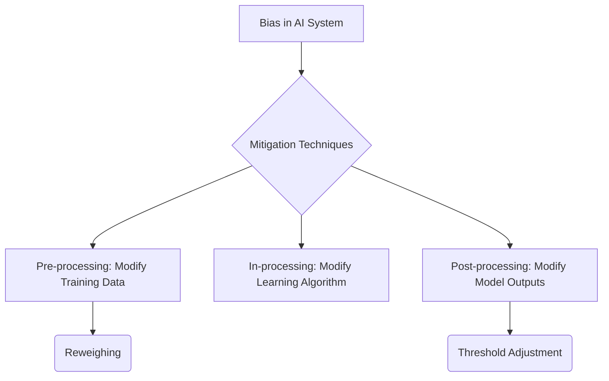

id: 692f5353e3ab8aa78e41971d_documentation
summary: AI Design and deployment lab 5 Documentation
feedback link: https://docs.google.com/forms/d/e/1FAIpQLSfWkOK-in_bMMoHSZfcIvAeO58PAH9wrDqcxnJABHaxiDqhSA/viewform?usp=sf_link
environments: Web
status: Published
# AI Credit Decision Explainer: XAI & Fairness with Streamlit

## 1. Introduction to AI Credit Decision Explainer
Duration: 0:10:00

In today's data-driven world, Artificial Intelligence (AI) models are increasingly making high-stakes decisions, from medical diagnoses to financial credit approvals. While these models offer efficiency and scale, their "black-box" nature often makes it difficult to understand *why* a particular decision was made. This lack of transparency can lead to issues of trust, accountability, and, critically, algorithmic bias.

This codelab will guide you through building an **AI Credit Decision Explainer** using Streamlit, focusing on a credit loan application scenario. We will explore how to make AI models more transparent and fair, which is crucial for stakeholders like Risk Managers, Executive Stakeholders, and Financial Data Engineers.

<aside class="positive">
<b>Why is this important?</b>
*   **Trust & Accountability**: Understanding model decisions fosters trust among users and allows for accountability when errors or biases occur.
*   **Regulatory Compliance**: Regulations like GDPR's "right to explanation" necessitate interpretable AI systems.
*   **Bias Detection & Mitigation**: AI models can inadvertently perpetuate or amplify societal biases. Tools for detecting and mitigating these biases are essential for ethical AI deployment.
</aside>

### Learning Goals

Upon completing this codelab, you will be able to:
*   Understand how local explainability tools (LIME) reveal factors influencing individual credit decisions.
*   Interpret global feature importance (SHAP) to grasp the model's overall decision-making patterns.
*   Identify potential biases in credit decisions across different demographic groups using fairness metrics (Statistical Parity Difference and Equal Opportunity Difference).
*   Evaluate the impact of simple mitigation techniques like reweighting and classification threshold adjustments on fairness and model performance.

### Key Concepts Explained

1.  **Explainable AI (XAI)**: A set of techniques that allows human users to understand, appropriately trust, and effectively manage AI-powered decision-making. We will delve into:
    *   **Local Interpretability (LIME)**: Explaining individual predictions.
    *   **Global Interpretability (SHAP)**: Understanding overall model behavior.
2.  **Algorithmic Fairness**: Ensuring that AI systems do not produce discriminatory outcomes against certain demographic groups. We will cover:
    *   **Fairness Metrics**: Quantifying bias (e.g., Statistical Parity Difference, Equal Opportunity Difference).
    *   **Bias Mitigation**: Strategies to reduce or eliminate identified biases (e.g., Reweighing, Threshold Adjustment).

### Application Architecture

The Streamlit application is structured modularly for clarity and maintainability.

```mermaid
graph TD
    A[app.py - Main Application] --> B(Streamlit Sidebar Navigation)
    B --> C1(application_pages/page_1_overview.py)
    B --> C2(application_pages/page_2_data_preparation.py)
    B --> C3(application_pages/page_3_baseline_model.py)
    B --> C4(application_pages/page_4_explainability.py)
    B --> C5(application_pages/page_5_fairness_analysis.py)
    B --> C6(application_pages/page_6_bias_mitigation.py)
    B --> C7(application_pages/page_7_comparative_analysis.py)
    C1  D(Intro & Goals)
    C2  E(Data Loading & Preprocessing)
    C3  F(Model Training & Evaluation)
    C4  G(XAI: LIME & SHAP)
    C5  H(Fairness Analysis)
    C6  I(Bias Mitigation)
    C7  J(Comparative Analysis & Summary)
    E --> K[utils.py - Core Functions]
    F --> K
    G --> K
    H --> K
    I --> K
    J --> K
    K --> L(german_credit.csv)
```

**Description of Components:**
*   `app.py`: The main entry point that sets up the Streamlit page configuration, initializes session state variables, and handles navigation between different functional pages.
*   `application_pages/`: A directory containing separate Python files for each major section of the application. This modular design helps organize the code.
*   `utils.py`: A utility file encapsulating all the core logic, including data loading, preprocessing, model training, evaluation, explainability functions (LIME, SHAP), and fairness calculations (`aif360`). This separation makes the code reusable and tests easier.
*   `german_credit.csv`: The dataset used for the credit decision application.

## 2. Setting Up Your Environment and Project Structure
Duration: 0:05:00

Before running the Streamlit application, you need to set up your Python environment and create the necessary file structure.

### Prerequisites
*   Python 3.8+
*   `pip` (Python package installer)

### Project Structure

Create a new directory named `ai_credit_explainer` (or any name you prefer). Inside this directory, create the following files and subdirectories:

```
ai_credit_explainer/
├── app.py
├── utils.py
├── german_credit.csv
└── application_pages/
    ├── __init__.py
    ├── page_1_overview.py
    ├── page_2_data_preparation.py
    ├── page_3_baseline_model.py
    ├── page_4_explainability.py
    ├── page_5_fairness_analysis.py
    ├── page_6_bias_mitigation.py
    └── page_7_comparative_analysis.py
```

Place the provided code snippets into their respective files. For `german_credit.csv`, you will need to obtain the dataset. A common version can be found in UCI Machine Learning Repository. For this codelab, assume you have a `german_credit.csv` file in the root directory of your project.

<aside class="positive">
A minimal `german_credit.csv` containing the expected column names can be created with some dummy data if you don't have the exact dataset readily available. However, for meaningful results, using the actual German Credit Data is recommended.
</aside>

### Installation Steps

Navigate to your project's root directory (`ai_credit_explainer/`) in your terminal and install the required Python packages:

```console
pip install streamlit pandas numpy matplotlib seaborn scikit-learn lime shap aif360
```

Once all packages are installed, you can run the Streamlit application:

```console
streamlit run app.py
```

This command will open the application in your web browser, typically at `http://localhost:8501`.

## 3. Data Loading and Preprocessing
Duration: 0:15:00

This section focuses on loading the dataset and preparing it for machine learning. Data preprocessing is a critical step to ensure the quality and suitability of data for model training.

### Dataset Overview

We use the "UCI German Credit Data" dataset. This dataset contains 20 attributes concerning 1000 applicants for credit, with a target variable indicating whether the applicant is "good" (credit approved) or "bad" (credit denied) risk.

**Original Attributes include:**
*   `Duration_of_Credit_month`: Credit duration in months
*   `Credit_Amount`: Amount of credit
*   `Personal_Status_and_Sex`: Gender and marital status
*   `Age_in_years`: Age of the applicant
*   ... and many more.

We will define `Gender` and `Age Group` as protected attributes for fairness analysis.

### Data Preprocessing Flow

```mermaid
graph TD
    A[Raw Data (german_credit.csv)] --> B{Load & Initial Exploration}
    B --> C{Rename Columns & Map Target}
    C --> D{Feature Engineering (Gender, AgeGroup)}
    D --> E{Define Protected Attributes}
    E --> F{Split Data (Train/Test)}
    F --> G{Preprocessing Pipeline (StandardScaler, OneHotEncoder)}
    G --> H[Preprocessed Data (X_train_df, X_test_df, y_train, y_test)]
```

### Core Functions (`utils.py`)

The `utils.py` file contains the functions for loading and preprocessing the data.

```python
# utils.py
import pandas as pd
import numpy as np
from sklearn.model_selection import train_test_split
from sklearn.preprocessing import StandardScaler, OneHotEncoder
from sklearn.compose import ColumnTransformer
from sklearn.pipeline import Pipeline
# ... other imports

def load_and_explore_data(file_path):
    """
    Loads the German Credit Data and displays its head, info, and shape.
    """
    data = pd.read_csv(file_path)
    return data

def preprocess_data(data):
    """
    Preprocesses the German Credit Data: renames columns, maps target,
    creates age groups, defines protected attributes, and splits data.
    """
    df_processed = data.copy()
    # Rename columns for clarity
    df_processed = df_processed.rename(columns={
        'Duration_of_Credit_month': 'CreditDuration',
        'Credit_Amount': 'LoanAmount',
        'Installation_Rate_in_Percentage_of_Disposable_Income': 'InstallmentRate',
        'Present_Residence_since': 'YearsResidence',
        'Age_in_years': 'Age',
        'Number_of_Credits_at_this_Bank': 'NumCredits',
        'Number_of_people_being_liable_to_provide_maintenance_for': 'NumDependents',
        'Class': 'LoanApproved'
    })
    # Map target variable: 1 (good credit) -> 1 (approved), 2 (bad credit) -> 0 (denied)
    df_processed['LoanApproved'] = df_processed['LoanApproved'].map({1: 1, 2: 0})

    # Feature Engineering: Extract Gender and create Age Groups
    df_processed['Gender'] = df_processed['Personal_Status_and_Sex'].apply(
        lambda x: 1 if 'male' in x.lower() else 0
    )
    bins = [18, 25, 35, 45, 55, 65, 100]
    labels = ['18-24', '25-34', '35-44', '45-54', '55-64', '65+']
    df_processed['AgeGroup'] = pd.cut(df_processed['Age'], bins=bins, labels=labels, right=False)
    df_processed['AgeGroup'] = df_processed['AgeGroup'].astype(str) # Convert to string for OHE
    df_processed = df_processed.drop(columns=['Personal_Status_and_Sex']) # Drop original column

    # Separate features (X) and target (y)
    X = df_processed.drop('LoanApproved', axis=1)
    y = df_processed['LoanApproved']

    # Identify categorical and numerical features
    categorical_features = X.select_dtypes(include='object').columns
    numerical_features = X.select_dtypes(include=['int64', 'float64']).columns

    # Create preprocessing pipelines for numerical and categorical features
    numerical_transformer = StandardScaler() # Scale numerical features
    categorical_transformer = OneHotEncoder(handle_unknown='ignore') # One-hot encode categorical features

    # Combine transformers using ColumnTransformer
    preprocessor = ColumnTransformer(
        transformers=[
            ('num', numerical_transformer, numerical_features),
            ('cat', categorical_transformer, categorical_features)
        ],
        remainder='passthrough' # Keep other columns if any, though not expected here
    )
    return X, y, preprocessor, categorical_features, numerical_features, df_processed.columns.tolist()

```

### Streamlit Integration (`application_pages/page_2_data_preparation.py`)

This page handles the Streamlit UI for data loading and preprocessing.

```python
# application_pages/page_2_data_preparation.py
import streamlit as st
import pandas as pd
from sklearn.model_selection import train_test_split
from utils import load_and_explore_data, preprocess_data # Import utility functions

def main():
    st.header("Section 3: Dataset Loading and Initial Exploration")
    st.markdown("""
    We will use a modified version of the 'UCI German Credit Data' dataset. This dataset contains demographic and financial attributes that influence credit decisions. It has a binary target variable indicating 'good' or 'bad' credit risk, which we will map to 'loan approval' or 'loan denial'. We will define 'Gender' and 'Age Group' as protected attributes for fairness analysis.
    The dataset is assumed to be available as `german_credit.csv` in the same directory as the notebook.
    """)

    if st.button("Load and Preprocess Data"):
        with st.spinner("Loading and preprocessing data..."):
            st.session_state.df = load_and_explore_data('german_credit.csv')
            X_raw, y, preprocessor, categorical_features, numerical_features, original_cols = preprocess_data(st.session_state.df)
            
            # Split data into training and testing sets
            X_train_pre, X_test_pre, y_train, y_test = train_test_split(X_raw, y, test_size=0.3, random_state=42, stratify=y)
            
            # Fit and transform data using the preprocessor
            preprocessor.fit(X_train_pre)
            X_train_transformed = preprocessor.transform(X_train_pre)
            X_test_transformed = preprocessor.transform(X_test_pre)
            
            # Dynamically get feature names after one-hot encoding
            encoded_feature_names = preprocessor.named_transformers_['cat'].get_feature_names_out(categorical_features)
            all_feature_names = list(numerical_features) + list(encoded_feature_names)

            # Store processed dataframes in session state
            st.session_state.X_train_df = pd.DataFrame(X_train_transformed, columns=all_feature_names, index=X_train_pre.index)
            st.session_state.X_test_df = pd.DataFrame(X_test_transformed, columns=all_feature_names, index=X_test_pre.index)
            st.session_state.y_train = y_train
            st.session_state.y_test = y_test
            st.session_state.preprocessor = preprocessor
            st.session_state.all_feature_names = all_feature_names
            
            # Define protected groups for aif360
            st.session_state.protected_attribute_names = ['Gender_0', 'Gender_1'] # One-hot encoded gender
            st.session_state.aif360_privileged_groups = [{'Gender_1': 1}] # Male
            st.session_state.aif360_unprivileged_groups = [{'Gender_0': 1}] # Female
            st.success("Data loaded and preprocessed!")

            st.markdown("Dataset Head:")
            st.dataframe(st.session_state.df.head())
            st.markdown(f"Dataset Shape: {st.session_state.df.shape}")
            st.markdown(f"Shape of X_train_df: {st.session_state.X_train_df.shape}")
            st.markdown(f"Shape of X_test_df: {st.session_state.X_test_df.shape}")
            st.markdown(f"Protected attribute names for fairness analysis: {st.session_state.protected_attribute_names}")
    else:
        st.info("Click 'Load and Preprocess Data' to begin.")

```

## 4. Training and Evaluating the Baseline Model
Duration: 0:10:00

With the data prepared, the next step is to train a machine learning model and evaluate its performance. We will use Logistic Regression as our baseline classifier.

### Logistic Regression Model

Logistic Regression is a simple, linear model often used for binary classification. Despite its name, it's a classification algorithm that models the probability of a binary outcome. It uses the logistic (sigmoid) function to map any real-valued number into a probability between 0 and 1.

The probability of the positive class ($P(\hat{Y}=1 | X)$) is given by:
$$ P(\hat{Y}=1 | X) = \frac{1}{1 + e^{-(\beta_0 + \beta_1X_1 + \dots + \beta_nX_n)}} $$
where:
*   $X$ represents the input features.
*   $\beta_0$ is the intercept.
*   $\beta_1, \dots, \beta_n$ are the coefficients for each feature $X_1, \dots, X_n$.

### Model Training (`utils.py`)

The `train_model` function in `utils.py` handles the training of the Logistic Regression model.

```python
# utils.py
# ... other imports
from sklearn.linear_model import LogisticRegression

def train_model(X_train, y_train, sample_weight=None):
    """
    Trains a Logistic Regression model.
    """
    model = LogisticRegression(solver='liblinear', random_state=42)
    model.fit(X_train, y_train, sample_weight=sample_weight)
    return model
```

### Model Evaluation (`utils.py`)

The `evaluate_model` function calculates and displays standard classification metrics. These metrics provide a comprehensive view of how well the model performs on unseen data.

```python
# utils.py
# ... other imports
from sklearn.metrics import accuracy_score, precision_score, recall_score, f1_score, confusion_matrix, classification_report

def evaluate_model(model, X_test, y_test, name="Model"):
    """
    Evaluates a given model and prints classification metrics.
    Returns metrics and predictions.
    """
    y_pred = model.predict(X_test)
    accuracy = accuracy_score(y_test, y_pred)
    precision = precision_score(y_test, y_pred)
    recall = recall_score(y_test, y_pred)
    f1 = f1_score(y_test, y_pred)
    conf_matrix = confusion_matrix(y_test, y_pred)

    st.subheader(f" {name} Evaluation ")
    st.metric(label="Accuracy", value=f"{accuracy:.4f}")
    st.metric(label="Precision", value=f"{precision:.4f}")
    st.metric(label="Recall", value=f"{recall:.4f}")
    st.metric(label="F1-Score", value=f"{f1:.4f}")

    st.markdown("##### Confusion Matrix:")
    st.dataframe(pd.DataFrame(conf_matrix, index=['Actual Denied', 'Actual Approved'], columns=['Predicted Denied', 'Predicted Approved']))
    st.markdown("##### Classification Report:")
    st.text(classification_report(y_test, y_pred))
    return accuracy, precision, recall, f1, conf_matrix, y_pred
```

**Understanding the Metrics:**
*   **Accuracy**: The ratio of correctly predicted observations to the total observations.
*   **Precision**: The ratio of correctly predicted positive observations to the total predicted positive observations. Useful when the cost of False Positives is high.
*   **Recall (Sensitivity)**: The ratio of correctly predicted positive observations to all observations in actual class. Useful when the cost of False Negatives is high.
*   **F1-Score**: The weighted average of Precision and Recall. It tries to find the balance between precision and recall.
*   **Confusion Matrix**: A table that describes the performance of a classification model on a set of test data for which the true values are known. It shows True Positives (TP), True Negatives (TN), False Positives (FP), and False Negatives (FN).

### Streamlit Integration (`application_pages/page_3_baseline_model.py`)

This page provides the UI to train and evaluate the baseline model.

```python
# application_pages/page_3_baseline_model.py
import streamlit as st
from utils import train_model, evaluate_model # Import utility functions

def main():
    st.header("Section 5: Baseline Model Training (Logistic Regression)")
    st.markdown(r"""
    We will train a Logistic Regression model as our baseline classifier. Logistic Regression is a simple, linear model often used for binary classification. It models the probability that a given input belongs to a particular class using the logistic function:
    $$ P(\hat{Y}=1 | X) = \frac{1}{1 + e^{-(\beta_0 + \beta_1X_1 + \dots + \beta_nX_n)}} $$
    where $P(\hat{Y}=1 | X)$ is the probability of the positive class, $X$ are the features, and $\beta$ are the model coefficients.
    """)
    if st.button("Train Baseline Model"):
        if st.session_state.get('X_train_df') is not None:
            with st.spinner("Training baseline model..."):
                st.session_state.baseline_model = train_model(st.session_state.X_train_df, st.session_state.y_train)
                st.success("Baseline Logistic Regression model trained.")
                st.header("Section 6: Baseline Model Evaluation")
                st.markdown("""
                To understand our baseline model's performance, we evaluate it using standard classification metrics:
                *   **Accuracy**: The proportion of correctly classified instances.
                *   **Precision**: The proportion of positive identifications that were actually correct.
                *   **Recall**: The proportion of actual positives that were identified correctly.
                *   **F1-Score**: The harmonic mean of Precision and Recall.
                *   **Confusion Matrix**: A table showing true positives (TP), true negatives (TN), false positives (FP), and false negatives (FN).
                """)
                st.session_state.baseline_accuracy, _, _, _, _, st.session_state.baseline_predictions = \
                    evaluate_model(st.session_state.baseline_model, st.session_state.X_test_df, st.session_state.y_test, "Baseline Model")
        else:
            st.warning("Please load and preprocess data first.")
```

## 5. Understanding Local Explainability with LIME
Duration: 0:15:00

**Explainable AI (XAI)** is crucial for building trust in complex models. We start with **local explainability**, which focuses on explaining *why* a single prediction was made.

### XAI Overview

```mermaid
graph TD
    A[AI Model Prediction] --> B{Local Explainability (LIME)}
    B --> C[Explanation for a Single Prediction]
    A --> D{Global Explainability (SHAP)}
    D --> E[Overall Feature Importance & Behavior]
```

### LIME (Local Interpretable Model-agnostic Explanations)

LIME is a technique to explain individual predictions of any "black-box" model. It works by training a simple, interpretable model (like a linear model or decision tree) locally around the prediction point.

**How LIME Works:**
1.  **Perturb the instance**: Create slightly modified versions of the instance you want to explain.
2.  **Get predictions**: Use the black-box model to predict the outcome for each perturbed instance.
3.  **Weigh the samples**: Assign weights to the perturbed samples based on their proximity to the original instance.
4.  **Train an interpretable model**: Train a simple, interpretable model (e.g., linear regression) on the perturbed samples, weighted by proximity.
5.  **Explain**: The coefficients of this local model serve as an explanation for the original instance's prediction.

The weighted loss function minimized by LIME is:
$$ L(f, g, \pi_x) = \sum_{z \in Z} \pi_x(z) (f(z) - g(z))^2 $$
where:
*   $f$ is the black-box model.
*   $g$ is the interpretable model (e.g., linear model).
*   $Z$ is the set of perturbed samples around the instance $x$.
*   $\pi_x(z)$ is the proximity measure of $z$ to the instance $x$ being explained.

### LIME Explanation Function (`utils.py`)

The `generate_lime_explanation` function in `utils.py` uses the `lime` library to generate explanations for a selected instance.

```python
# utils.py
import lime
import lime.lime_tabular
# ... other imports

def generate_lime_explanation(model, X_train_df, X_test_df, feature_names, instance_idx):
    """
    Generates and visualizes a LIME explanation for a specific instance.
    """
    explainer = lime.lime_tabular.LimeTabularExplainer(
        training_data=X_train_df.values, # LIME expects numpy array for training data
        feature_names=feature_names,
        class_names=['Denied', 'Approved'],
        mode='classification',
        random_state=42
    )

    instance = X_test_df.iloc[instance_idx]
    explanation = explainer.explain_instance(
        data_row=instance.values,
        predict_fn=model.predict_proba, # LIME uses predict_proba for classification
        num_features=10, # Number of features to show in the explanation
        num_samples=5000 # Number of perturbed samples to generate
    )

    st.subheader(f"LIME Explanation for instance {instance_idx}")
    st.write(f"True Label: {st.session_state.y_test.iloc[instance_idx]}, Predicted: {model.predict(instance.to_frame().T)[0]}")
    st.write("Model prediction probabilities: ", model.predict_proba(instance.to_frame().T)[0])

    fig = explanation.as_pyplot_figure()
    plt.title(f'LIME Explanation for Test Instance {instance_idx}')
    plt.tight_layout()
    return fig
```

### Streamlit Integration (`application_pages/page_4_explainability.py`)

This page allows you to interactively select a test instance and generate its LIME explanation.

```python
# application_pages/page_4_explainability.py
import streamlit as st
import matplotlib.pyplot as plt
from utils import generate_lime_explanation # Import LIME utility function

def main():
    st.header("Section 7: Local Explainability with LIME")
    st.markdown(r"""
    **LIME (Local Interpretable Model-agnostic Explanations)** is a technique to explain individual predictions of any black-box model. It works by training a simple, interpretable model (like a linear model or decision tree) locally around the prediction point. The core idea is to approximate the complex model locally with an interpretable one.

    The weighted loss function minimized by LIME is:
    $$ L(f, g, \pi_x) = \sum_{z \in Z} \pi_x(z) (f(z) - g(z))^2 $$
    where $f$ is the black-box model, $g$ is the interpretable model, $Z$ is the set of perturbed samples, and $\pi_x(z)$ is the proximity measure of $z$ to the instance $x$ being explained.
    """)
    if st.session_state.get('baseline_model') is not None:
        max_idx = len(st.session_state.X_test_df) - 1
        if max_idx >= 0:
            st.session_state.selected_instance_idx = st.slider("Select Test Instance Index for LIME", 0, max_idx, 0)
            if st.button("Generate LIME Explanation"):
                with st.spinner("Generating LIME explanation..."):
                    lime_fig = generate_lime_explanation(
                        st.session_state.baseline_model,
                        st.session_state.X_train_df,
                        st.session_state.X_test_df,
                        st.session_state.all_feature_names,
                        st.session_state.selected_instance_idx
                    )
                    st.pyplot(lime_fig)
                    plt.close(lime_fig)
                    st.markdown("""
                    A LIME explanation has been generated for a selected applicant from the test set. The plot shows the features that most influenced the model's prediction for this specific individual. Positive contributions indicate features pushing towards 'Approved' (Class 1), while negative contributions push towards 'Denied' (Class 0). For instance, if 'LoanAmount' is high and contributes negatively, it suggests that for this applicant, a high loan amount was a factor against approval.
                    """)
        else:
            st.warning("Test dataset is empty. Cannot generate LIME explanation.")
    else:
        st.warning("Please train the baseline model first.")
```

## 6. Exploring Global Explainability with SHAP
Duration: 0:15:00

While LIME explains individual predictions, **global explainability** helps understand the model's overall behavior and which features are generally most important.

### SHAP (SHapley Additive exPlanations)

SHAP provides a unified framework to explain predictions by assigning each feature an importance value (a "SHAP value") for a particular prediction. It is based on Shapley values from cooperative game theory. Each feature's contribution is the average marginal contribution across all possible "coalitions" of features.

**How SHAP Works:**
*   **Shapley Values**: The unique solution in game theory for fairly distributing the "payout" among players based on their marginal contribution to the game.
*   **Feature Contributions**: In the context of ML, features are "players", and the model prediction is the "payout". SHAP values quantify how much each feature contributes to the difference between the actual prediction and the average prediction.

The SHAP value $\phi_j$ for a feature $j$ is calculated as:
$$ \phi_j = \sum_{S \subseteq N \setminus \{j\}} \frac{|S|!(|N| - |S| - 1)!}{|N|!} [f_x(S \cup \{j\}) - f_x(S)] $$
where:
*   $N$ is the set of all features.
*   $S$ is a subset of features not including $j$.
*   $f_x(S)$ is the model's prediction with only features in $S$ present (marginalizing out features not in $S$).
*   $f_x(S \cup \{j\})$ is the model's prediction with features in $S$ and feature $j$ present.

### SHAP Explanation Functions (`utils.py`)

The `utils.py` file includes functions for generating SHAP summary and dependence plots.

```python
# utils.py
import shap
# ... other imports

def generate_shap_summary(model, X_train_df, X_test_df, feature_names):
    """
    Generates and visualizes a SHAP summary plot for global feature importance.
    """
    # Using KernelExplainer for model-agnostic explanations (Logistic Regression is technically not a tree model)
    # The background dataset for KernelExplainer is crucial for its performance and accuracy.
    # X_train_df is used as the background distribution.
    explainer = shap.KernelExplainer(model.predict_proba, X_train_df)
    shap_values = explainer.shap_values(X_test_df) # Calculate SHAP values for test set

    st.subheader("SHAP Summary Plot (Global Feature Importance)")
    fig, ax = plt.subplots(figsize=(10, 6))
    # shap_values[1] because we are interested in the 'Approved' class (index 1)
    shap.summary_plot(shap_values[1], X_test_df, feature_names=feature_names, show=False, plot_size=None, ax=ax)
    plt.title('SHAP Global Feature Importance (Loan Approved)')
    plt.tight_layout()
    return fig, shap_values

def generate_shap_dependence_plot(shap_values, X_data, feature_name, interaction_feature=None):
    """
    Generates a SHAP dependence plot for a specific feature.
    """
    st.subheader(f"SHAP Dependence Plot for '{feature_name}'")
    fig, ax = plt.subplots(figsize=(10, 6))
    shap.dependence_plot(
        ind=feature_name,
        shap_values=shap_values[1], # Focus on positive class
        features=X_data,
        feature_names=X_data.columns.tolist(),
        interaction_index=interaction_feature, # Optional interaction feature
        show=False, ax=ax
    )
    plt.title(f'SHAP Dependence Plot: {feature_name}')
    plt.tight_layout()
    return fig
```

### Streamlit Integration (`application_pages/page_4_explainability.py`)

The explainability page also includes the UI for SHAP plots.

```python
# application_pages/page_4_explainability.py
import streamlit as st
import matplotlib.pyplot as plt
from utils import generate_shap_summary, generate_shap_dependence_plot # Import SHAP utility functions
# ... (LIME code is above this in the actual file)

    st.header("Section 8: Global Explainability with SHAP")
    st.markdown(r"""
    **SHAP (SHapley Additive exPlanations)** provides a unified framework to explain predictions by assigning each feature an importance value for a particular prediction. It is based on Shapley values from cooperative game theory. Each feature's contribution is the average marginal contribution across all possible coalitions of features.

    The SHAP value $\phi_j$ for a feature $j$ is calculated as:
    $$ \phi_j = \sum_{S \subseteq N \setminus \{j\}} \frac{|S|!(|N| - |S| - 1)!}{|N|!} [f_x(S \cup \{j\}) - f_x(S)] $$
    where $N$ is the set of all features, $S$ is a subset of features, and $f_x(S)$ is the model's prediction with features in $S$ present.
    """)
    if st.session_state.get('baseline_model') is not None:
        if st.button("Generate SHAP Summary Plot"):
            with st.spinner("Generating SHAP summary plot..."):
                shap_fig, st.session_state.shap_values_baseline = generate_shap_summary(
                    st.session_state.baseline_model,
                    st.session_state.X_train_df,
                    st.session_state.X_test_df,
                    st.session_state.all_feature_names
                )
                st.pyplot(shap_fig)
                plt.close(shap_fig)
                st.markdown("""
                The SHAP summary plot provides a global view of feature importance. Each point represents a Shapley value for a feature and an instance. The color indicates the feature value (red for high, blue for low), and the position on the x-axis indicates the impact on the model's output (higher SHAP value means higher prediction of 'Approved'). Features are ordered by their overall impact. This helps Risk Managers understand the primary drivers of credit approval across the entire portfolio.
                """)
    else:
        st.warning("Please train the baseline model first.")

    st.header("Section 9: SHAP Dependence Plots")
    st.markdown("""
    SHAP dependence plots show how the value of a single feature affects the prediction of the model, often revealing non-linear relationships or interactions with other features. Each point on the plot is a single prediction from the dataset.
    """)
    if st.session_state.get('shap_values_baseline') is not None and st.session_state.get('all_feature_names') is not None:
        st.session_state.selected_dependence_feature = st.selectbox(
            "Select Feature for Dependence Plot",
            st.session_state.all_feature_names,
            index=st.session_state.all_feature_names.index('CreditDuration') if 'CreditDuration' in st.session_state.all_feature_names else 0
        )
        interaction_options = ['None'] + st.session_state.all_feature_names
        st.session_state.selected_interaction_feature = st.selectbox(
            "Select Interaction Feature (Optional)",
            interaction_options,
            index=interaction_options.index('LoanAmount') if 'LoanAmount' in interaction_options else 0
        )
        interaction_feat = None if st.session_state.selected_interaction_feature == 'None' else st.session_state.selected_interaction_feature

        if st.button("Generate SHAP Dependence Plot"):
            with st.spinner("Generating SHAP dependence plot..."):
                dep_fig = generate_shap_dependence_plot(
                    st.session_state.shap_values_baseline,
                    st.session_state.X_test_df,
                    st.session_state.selected_dependence_feature,
                    interaction_feat
                )
                st.pyplot(dep_fig)
                plt.close(dep_fig)
                st.markdown("""
                The SHAP dependence plot illustrates how the value of the selected feature impacts the prediction for loan approval. We can observe patterns such as whether longer or shorter credit durations tend to increase or decrease the probability of approval. If an interaction feature was used, the color variation would indicate how the interaction with that feature further influences the prediction. This helps understand specific feature behaviors.
                """)
    else:
        st.warning("Please generate SHAP summary plot first to enable dependence plots.")
```

## 7. Assessing Algorithmic Fairness
Duration: 0:15:00

After understanding the model's predictions, it's crucial to assess its fairness. Algorithmic fairness ensures that the model's decisions are not biased against certain protected groups. We will use the `aif360` library for this.

### Fairness Metrics

We will focus on two commonly used fairness metrics:

1.  **Statistical Parity Difference (SPD)**:
    Measures the difference in the proportion of positive outcomes (e.g., loan approvals) between the privileged group ($a_1$) and the unprivileged group ($a_0$). A value of 0 indicates perfect statistical parity. A positive SPD means the privileged group is more likely to receive a favorable outcome.
    $$ SPD = P(\hat{Y}=1|A=a_1) - P(\hat{Y}=1|A=a_0) $$
    where $P(\hat{Y}=1|A=a_i)$ is the probability of a positive outcome (loan approval) for group $a_i$.

2.  **Equal Opportunity Difference (EOD)**:
    Measures the difference in the true positive rates (recall for the positive class) between the privileged group ($a_1$) and the unprivileged group ($a_0$), specifically among those who are truly qualified (actual $Y=1$). A value of 0 indicates perfect equal opportunity. A positive EOD means the privileged group is more likely to be correctly approved when they are truly creditworthy.
    $$ EOD = P(\hat{Y}=1|A=a_1, Y=1) - P(\hat{Y}=1|A=a_0, Y=1) $$
    where $P(\hat{Y}=1|A=a_i, Y=1)$ is the true positive rate for group $a_i$.

<aside class="negative">
A positive SPD or EOD indicates bias favoring the privileged group, while a negative value indicates bias favoring the unprivileged group. Values further from zero suggest greater disparity.
</aside>

### Calculating Fairness Metrics (`utils.py`)

The `calculate_fairness_metrics` function in `utils.py` uses `aif360` to compute SPD and EOD.

```python
# utils.py
# ... other imports
from aif360.datasets import StandardDataset
from aif360.metrics import BinaryLabelDatasetMetric, ClassificationMetric

def calculate_fairness_metrics(model, X_test, y_test, protected_attribute_names, privileged_groups, unprivileged_groups, model_name="Model"):
    """
    Calculates and displays Statistical Parity Difference (SPD) and Equal Opportunity Difference (EOD).
    Returns metrics and a matplotlib figure.
    """
    # Create an AIF360 StandardDataset for fairness evaluation
    # protected_attribute_names, privileged_classes, unprivileged_classes are defined in page_2
    aif_test_df = pd.concat([X_test, y_test], axis=1)
    aif_test_ds = StandardDataset(
        aif_test_df,
        label_name='LoanApproved',
        favorable_classes=[1], # '1' for loan approved
        protected_attribute_names=['Gender_1'], # Assuming 'Gender_1' is the one-hot encoded male column
        privileged_classes=[[1]], # Male (Gender_1=1) is the privileged group
        unprivileged_classes=[[0]] # Female (Gender_0=1 implied, here represented as Gender_1=0)
    )

    y_pred = model.predict(X_test)
    dataset_pred = aif_test_ds.copy()
    dataset_pred.labels = y_pred # Set the predicted labels

    # Use ClassificationMetric to compute fairness metrics
    metric = ClassificationMetric(
        aif_test_ds,
        dataset_pred,
        unprivileged_groups=unprivileged_groups,
        privileged_groups=privileged_groups
    )

    spd = metric.statistical_parity_difference()
    eod = metric.equal_opportunity_difference()
    tpr_priv = metric.true_positive_rate(privileged=True)
    tpr_unpriv = metric.true_positive_rate(privileged=False)
    pos_outcome_priv = metric.positive_prediction_rate(privileged=True)
    pos_outcome_unpriv = metric.positive_prediction_rate(privileged=False)

    st.subheader(f" {model_name} Fairness Metrics ")
    st.write(f"Protected Attribute: Gender (Privileged: Male, Unprivileged: Female)")
    st.write(f"Statistical Parity Difference (SPD): `{spd:.4f}`")
    st.write(f"Equal Opportunity Difference (EOD): `{eod:.4f}`")
    st.write(f"True Positive Rate (Privileged Group): `{tpr_priv:.4f}`")
    st.write(f"True Positive Rate (Unprivileged Group): `{tpr_unpriv:.4f}`")
    st.write(f"Positive Outcome Rate (Privileged Group): `{pos_outcome_priv:.4f}`")
    st.write(f"Positive Outcome Rate (Unprivileged Group): `{pos_outcome_unpriv:.4f}`")

    metrics_data = {
        'Metric': ['SPD', 'EOD'],
        'Value': [spd, eod]
    }
    metrics_df = pd.DataFrame(metrics_data)

    fig, ax = plt.subplots(figsize=(8, 5))
    sns.barplot(x='Metric', y='Value', data=metrics_df, palette='viridis', ax=ax)
    ax.axhline(0, color='grey', linestyle='--', linewidth=0.8)
    ax.set_title(f'{model_name} Fairness Metrics')
    ax.set_ylabel('Metric Value')
    ax.set_ylim(-0.5, 0.5) # Set consistent y-axis for comparison
    plt.tight_layout()
    return spd, eod, fig
```

### Streamlit Integration (`application_pages/page_5_fairness_analysis.py`)

This page provides the UI to calculate and display the baseline fairness metrics.

```python
# application_pages/page_5_fairness_analysis.py
import streamlit as st
import matplotlib.pyplot as plt
from utils import calculate_fairness_metrics # Import fairness utility

def main():
    st.header("Section 10: Introduction to Fairness Metrics")
    st.markdown(r"""
    Algorithmic fairness is crucial in high-stakes decisions like credit approval. We will use two common fairness metrics:
    *   **Statistical Parity Difference (SPD)**: Measures the difference in the proportion of positive outcomes (loan approvals) between the unprivileged group ($a_0$) and the privileged group ($a_1$). A value of 0 indicates perfect statistical parity.
        $$ SPD = P(\hat{Y}=1|A=a_1) - P(\hat{Y}=1|A=a_0) $$
        where $P(\hat{Y}=1|A=a_i)$ is the probability of a positive outcome (loan approval) for group $a_i$. A positive SPD means the privileged group is more likely to be approved.

    *   **Equal Opportunity Difference (EOD)**: Measures the difference in the true positive rates (recall for the positive class) between the unprivileged group ($a_0$) and the privileged group ($a_1$), specifically among those who are truly qualified (actual $Y=1$). A value of 0 indicates perfect equal opportunity.
        $$ EOD = P(\hat{Y}=1|A=a_1, Y=1) - P(\hat{Y}=1|A=a_0, Y=1) $$
        where $P(\hat{Y}=1|A=a_i, Y=1)$ is the true positive rate for group $a_i$. A positive EOD means the privileged group is more likely to be correctly approved when they are truly creditworthy.
    """)

    st.header("Section 11: Calculating Baseline Fairness Metrics")
    st.markdown("We will calculate SPD and EOD for our baseline Logistic Regression model using `aif360`. We define 'Gender_1' (male) as the privileged group and 'Gender_0' (female) as the unprivileged group. The favorable label for loan approval is 1.")

    if st.button("Calculate Baseline Fairness Metrics"):
        if st.session_state.get('baseline_model') is not None and st.session_state.get('X_test_df') is not None:
            with st.spinner("Calculating baseline fairness metrics..."):
                st.session_state.baseline_spd, st.session_state.baseline_eod, baseline_fairness_fig = calculate_fairness_metrics(
                    st.session_state.baseline_model,
                    st.session_state.X_test_df,
                    st.session_state.y_test,
                    st.session_state.protected_attribute_names,
                    st.session_state.aif360_privileged_groups,
                    st.session_state.aif360_unprivileged_groups,
                    model_name="Baseline Model"
                )
                st.pyplot(baseline_fairness_fig)
                plt.close(baseline_fairness_fig)
                st.markdown("""
                The baseline model's fairness metrics show the extent of disparate impact and unequal opportunity between the male (privileged) and female (unprivileged) groups regarding loan approvals. A non-zero value suggests bias, with positive values indicating bias favoring the privileged group. The bar chart visually represents these disparities.
                """)
        else:
            st.warning("Please train the baseline model first.")
```

## 8. Mitigating Bias: Reweighing (Pre-processing)
Duration: 0:15:00

Once bias is detected, the next step is to apply mitigation techniques. These techniques can be categorized into pre-processing, in-processing, and post-processing methods.

### Bias Mitigation Approaches



### Reweighing

**Reweighing** is a pre-processing bias mitigation technique that adjusts the weights of individual training samples to reduce disparities in outcomes for protected groups. It aims to create a more balanced dataset effectively by giving more importance to underrepresented or unfairly treated groups.

**How Reweighing Works:**
The principle involves assigning higher weights to instances from unprivileged groups or those with unfavorable outcomes during training. This adjustment influences the model's learning process, making it pay more attention to these samples, thereby reducing bias. For a sample $(x_i, y_i)$, the reweighted loss term might be $w_i \cdot Loss(y_i, \hat{y}_i)$, where $w_i$ is the adjusted sample weight.

### Reweighing Function (`utils.py`)

The `apply_reweighing_and_retrain` function in `utils.py` applies the `Reweighing` algorithm from `aif360` and retrains the model.

```python
# utils.py
# ... other imports
from aif360.algorithms.preprocessing import Reweighing

def apply_reweighing_and_retrain(X_train, y_train, protected_attribute_names, privileged_groups, unprivileged_groups):
    """
    Applies Reweighing preprocessing and retrains a Logistic Regression model.
    """
    aif_train_df = pd.concat([X_train, y_train], axis=1)
    aif_train_ds = StandardDataset(
        aif_train_df,
        label_name='LoanApproved',
        favorable_classes=[1],
        protected_attribute_names=['Gender_1'], # Male
        privileged_classes=[[1]],
        unprivileged_classes=[[0]] # Female
    )
    
    # Initialize and fit Reweighing algorithm
    RW = Reweighing(unprivileged_groups=unprivileged_groups, privileged_groups=privileged_groups)
    aif_train_ds_reweighed = RW.fit_transform(aif_train_ds)
    
    # Extract reweighed data and sample weights
    X_train_reweighed = pd.DataFrame(aif_train_ds_reweighed.features, columns=X_train.columns, index=X_train.index)
    y_train_reweighed = aif_train_ds_reweighed.labels.ravel()
    sample_weights = aif_train_ds_reweighed.instance_weights
    
    # Retrain model with sample weights
    reweighed_model = train_model(X_train_reweighed, y_train_reweighed, sample_weight=sample_weights)
    return reweighed_model
```

### Streamlit Integration (`application_pages/page_6_bias_mitigation.py`)

This page provides the UI to apply reweighing and evaluate the new model.

```python
# application_pages/page_6_bias_mitigation.py
import streamlit as st
import matplotlib.pyplot as plt
from utils import apply_reweighing_and_retrain, evaluate_model, calculate_fairness_metrics
# ... (Threshold adjustment related imports come later)

def main():
    st.header("Section 12: Bias Mitigation Technique: Reweighting")
    st.markdown(r"""
    **Reweighting** is a pre-processing bias mitigation technique that adjusts the weights of individual training samples to reduce disparities in outcomes for protected groups. It aims to create a more balanced dataset effectively by giving more importance to underrepresented or unfairly treated groups.

    The principle involves adjusting sample weights $w_i$ in the loss function during training, typically to equalize the representation of protected groups. For a sample $(x_i, y_i)$, the reweighted loss term might be $w_i \cdot Loss(y_i, \hat{y}_i)$. By assigning higher weights to instances from unprivileged groups or those with unfavorable outcomes, the model learns to pay more attention to these samples, thus reducing bias.
    """)
    if st.button("Apply Reweighing & Retrain Model"):
        if st.session_state.get('X_train_df') is not None:
            with st.spinner("Applying Reweighing and retraining model..."):
                st.session_state.reweighed_model = apply_reweighing_and_retrain(
                    st.session_state.X_train_df,
                    st.session_state.y_train,
                    st.session_state.protected_attribute_names,
                    st.session_state.aif360_privileged_groups,
                    st.session_state.aif360_unprivileged_groups
                )
                st.success("Model retrained after applying Reweighing mitigation.")
                st.header("Section 13: Evaluating Reweighted Model Performance and Fairness")
                st.markdown("After applying the reweighting technique, we need to evaluate its impact on both model performance (accuracy, precision, recall, F1-score) and fairness metrics (SPD, EOD). We will compare these results against the baseline model to assess the effectiveness and any potential trade-offs.")
                st.session_state.reweighed_accuracy, _, _, _, _, st.session_state.reweighed_predictions = \
                    evaluate_model(st.session_state.reweighed_model, st.session_state.X_test_df, st.session_state.y_test, "Reweighed Model")
                st.session_state.reweighed_spd, st.session_state.reweighed_eod, reweighed_fairness_fig = calculate_fairness_metrics(
                    st.session_state.reweighed_model,
                    st.session_state.X_test_df,
                    st.session_state.y_test,
                    st.session_state.protected_attribute_names,
                    st.session_state.aif360_privileged_groups,
                    st.session_state.aif360_unprivileged_groups,
                    model_name="Reweighed Model"
                )
                st.pyplot(reweighed_fairness_fig)
                plt.close(reweighed_fairness_fig)
                st.markdown("""
                The reweighted model shows its accuracy and updated fairness metrics. We can observe whether reweighting successfully reduced the bias as measured by SPD and EOD. There might be a slight change in overall accuracy as fairness-accuracy trade-offs are common in bias mitigation.
                """)
        else:
            st.warning("Please load and preprocess data first.")
```

## 9. Mitigating Bias: Threshold Adjustment (Post-processing)
Duration: 0:15:00

Another common bias mitigation technique, applied after the model has made its predictions, is threshold adjustment.

### Threshold Adjustment

**Threshold Adjustment** is a post-processing bias mitigation technique. Instead of changing the model or the data, it modifies the classification threshold ($T$) after the model has outputted its probabilities. This allows for achieving fairness targets by adjusting the threshold for different demographic groups.

**How Threshold Adjustment Works:**
For a group $a_i$, the prediction $\hat{Y}=1$ (approved) if the predicted probability $P(\hat{Y}=1|A=a_i)$ is greater than its group-specific threshold $T_{a_i}$. By optimizing these group-specific thresholds, we can equalize fairness metrics like True Positive Rate (to achieve Equal Opportunity) or Positive Prediction Rate (to achieve Statistical Parity) across groups.

The `aif360` library provides `CalibratedEqOddsPostprocessing` which is an example of such a technique. It aims to achieve equalized odds by finding the optimal classification thresholds for each group.

### Threshold Adjustment Function (`utils.py`)

The `apply_threshold_adjustment_and_evaluate` function in `utils.py` uses `CalibratedEqOddsPostprocessing` from `aif360`.

```python
# utils.py
# ... other imports
from aif360.algorithms.postprocessing import CalibratedEqOddsPostprocessing

def apply_threshold_adjustment_and_evaluate(model, X_train, y_train, X_test, y_test, protected_attribute_names, privileged_groups, unprivileged_groups):
    """
    Applies Calibrated Equalized Odds Postprocessing for threshold adjustment and re-evaluates.
    Returns metrics, adjusted predictions, and a matplotlib figure.
    """
    # Create AIF360 StandardDatasets for both train and test
    aif_train_df = pd.concat([X_train, y_train], axis=1)
    aif_train_ds = StandardDataset(
        aif_train_df, label_name='LoanApproved', favorable_classes=[1],
        protected_attribute_names=['Gender_1'], privileged_classes=[[1]], unprivileged_classes=[[0]]
    )
    aif_test_df = pd.concat([X_test, y_test], axis=1)
    aif_test_ds = StandardDataset(
        aif_test_df, label_name='LoanApproved', favorable_classes=[1],
        protected_attribute_names=['Gender_1'], privileged_classes=[[1]], unprivileged_classes=[[0]]
    )
    
    # Get model probabilities
    y_proba_train = model.predict_proba(X_train)[:, 1]
    y_proba_test = model.predict_proba(X_test)[:, 1]
    
    # Create AIF360 datasets with predicted scores
    dataset_pred_train = aif_train_ds.copy(deepcopy=True)
    dataset_pred_train.scores = y_proba_train.reshape(-1, 1)
    dataset_pred_test = aif_test_ds.copy(deepcopy=True)
    dataset_pred_test.scores = y_proba_test.reshape(-1, 1)

    # Initialize and fit Calibrated Equalized Odds Postprocessing
    ceopp = CalibratedEqOddsPostprocessing(
        unprivileged_groups=unprivileged_groups, privileged_groups=privileged_groups, cost_constraint='weighted'
    )
    ceopp = ceopp.fit(aif_train_ds, dataset_pred_train) # Fit on training data
    
    # Apply to test data
    dataset_pred_transformed_test = ceopp.predict(dataset_pred_test)
    y_pred_adjusted = dataset_pred_transformed_test.labels.ravel() # Extract adjusted predictions

    # Evaluate performance of the adjusted model
    adjusted_accuracy = accuracy_score(y_test, y_pred_adjusted)
    adjusted_precision = precision_score(y_test, y_pred_adjusted)
    adjusted_recall = recall_score(y_test, y_pred_adjusted)
    adjusted_f1 = f1_score(y_test, y_pred_adjusted)
    adjusted_conf_matrix = confusion_matrix(y_test, y_pred_adjusted)

    st.subheader(" Threshold-Adjusted Model Evaluation ")
    st.metric(label="Accuracy", value=f"{adjusted_accuracy:.4f}")
    st.metric(label="Precision", value=f"{adjusted_precision:.4f}")
    st.metric(label="Recall", value=f"{adjusted_recall:.4f}")
    st.metric(label="F1-Score", value=f"{adjusted_f1:.4f}")
    st.markdown("##### Confusion Matrix:")
    st.dataframe(pd.DataFrame(adjusted_conf_matrix, index=['Actual Denied', 'Actual Approved'], columns=['Predicted Denied', 'Predicted Approved']))
    st.markdown("##### Classification Report:")
    st.text(classification_report(y_test, y_pred_adjusted))

    # Calculate fairness metrics for the adjusted model
    adjusted_metrics = ClassificationMetric(
        aif_test_ds, dataset_pred_transformed_test,
        unprivileged_groups=unprivileged_groups, privileged_groups=privileged_groups
    )
    adjusted_spd = adjusted_metrics.statistical_parity_difference()
    adjusted_eod = adjusted_metrics.equal_opportunity_difference()

    st.subheader(" Threshold-Adjusted Model Fairness Metrics ")
    st.write(f"Protected Attribute: Gender (Privileged: Male, Unprivileged: Female)")
    st.write(f"Statistical Parity Difference (SPD): `{adjusted_spd:.4f}`")
    st.write(f"Equal Opportunity Difference (EOD): `{adjusted_eod:.4f}`")

    metrics_data = {
        'Metric': ['SPD', 'EOD'],
        'Value': [adjusted_spd, adjusted_eod]
    }
    metrics_df = pd.DataFrame(metrics_data)

    fig, ax = plt.subplots(figsize=(8, 5))
    sns.barplot(x='Metric', y='Value', data=metrics_df, palette='cividis', ax=ax)
    ax.axhline(0, color='grey', linestyle='--', linewidth=0.8)
    ax.set_title(f'Threshold-Adjusted Model Fairness Metrics')
    ax.set_ylabel('Metric Value')
    ax.set_ylim(-0.5, 0.5)
    plt.tight_layout()
    return adjusted_accuracy, adjusted_spd, adjusted_eod, y_pred_adjusted, fig
```

### Streamlit Integration (`application_pages/page_6_bias_mitigation.py`)

The bias mitigation page also provides the UI for threshold adjustment.

```python
# application_pages/page_6_bias_mitigation.py
# ... (Reweighing code is above this in the actual file)
from utils import apply_threshold_adjustment_and_evaluate # Import utility

    st.header("Section 14: Bias Mitigation Technique: Threshold Adjustment")
    st.markdown(r"""
    **Threshold Adjustment** is a post-processing bias mitigation technique. Instead of changing the model or the data, it modifies the classification threshold ($T$) after the model has made its predictions. This allows for achieving fairness targets by adjusting the threshold for different demographic groups.

    For example, for a group $a_0$, the prediction $\hat{Y}=1$ if $P(\hat{Y}=1|A=a_0) > T_{a_0}$. By optimizing group-specific thresholds, we can equalize metrics like True Positive Rate (to achieve Equal Opportunity) or Positive Prediction Rate (to achieve Statistical Parity) across groups.
    """)
    if st.button("Apply Threshold Adjustment & Re-evaluate Model"):
        if st.session_state.get('baseline_model') is not None:
            with st.spinner("Applying threshold adjustment and re-evaluating..."):
                st.session_state.adjusted_accuracy, st.session_state.adjusted_spd, st.session_state.adjusted_eod, st.session_state.threshold_adjusted_predictions, adjusted_fairness_fig = \
                    apply_threshold_adjustment_and_evaluate(
                        st.session_state.baseline_model,
                        st.session_state.X_train_df,
                        st.session_state.y_train,
                        st.session_state.X_test_df,
                        st.session_state.y_test,
                        st.session_state.protected_attribute_names,
                        st.session_state.aif360_privileged_groups,
                        st.session_state.aif360_unprivileged_groups
                    )
                st.pyplot(adjusted_fairness_fig)
                plt.close(adjusted_fairness_fig)
                st.markdown("""
                By applying Calibrated Equalized Odds Postprocessing, the classification thresholds were adjusted for different groups. This technique directly intervenes on the model's output to balance fairness metrics, potentially leading to a more equitable distribution of loan approvals while aiming to maintain performance.
                """)
        else:
            st.warning("Please train the baseline model first.")
```

## 10. Comparative Analysis and Key Takeaways
Duration: 0:10:00

This final section brings everything together by comparing the performance and fairness of the baseline model against the models treated with bias mitigation techniques.

### Comparative Metrics Plotting (`utils.py`)

The `plot_comparative_metrics` function in `utils.py` generates bar charts to visually compare the key metrics.

```python
# utils.py
# ... other imports

def plot_comparative_metrics(baseline_acc, baseline_spd, baseline_eod,
                                 reweighed_acc, reweighed_spd, reweighed_eod,
                                 adjusted_acc, adjusted_spd, adjusted_eod):
    """
    Plots comparative bar charts for accuracy, SPD, and EOD across models.
    """
    metrics = ['Accuracy', 'SPD', 'EOD']
    baseline_values = [baseline_acc, baseline_spd, baseline_eod]
    reweighed_values = [reweighed_acc, reweighed_spd, reweighed_eod]
    adjusted_values = [adjusted_acc, adjusted_spd, adjusted_eod]

    df_comparison = pd.DataFrame({
        'Metric': metrics * 3,
        'Value': baseline_values + reweighed_values + adjusted_values,
        'Model': ['Baseline'] * 3 + ['Reweighed'] * 3 + ['Threshold-Adjusted'] * 3
    })

    fig, axes = plt.subplots(1, 3, figsize=(18, 6), sharey=False) # Separate y-axes for different metric scales

    sns.barplot(x='Model', y='Value', data=df_comparison[df_comparison['Metric'] == 'Accuracy'], ax=axes[0], palette='pastel')
    axes[0].set_title('Model Accuracy Comparison')
    axes[0].set_ylabel('Accuracy')
    axes[0].set_ylim(0.6, 0.8) # Consistent y-limit for accuracy

    sns.barplot(x='Model', y='Value', data=df_comparison[df_comparison['Metric'] == 'SPD'], ax=axes[1], palette='deep')
    axes[1].axhline(0, color='grey', linestyle='--', linewidth=0.8)
    axes[1].set_title('Statistical Parity Difference (SPD) Comparison')
    axes[1].set_ylabel('SPD Value')
    axes[1].set_ylim(-0.2, 0.2) # Consistent y-limit for SPD around 0

    sns.barplot(x='Model', y='Value', data=df_comparison[df_comparison['Metric'] == 'EOD'], ax=axes[2], palette='dark')
    axes[2].axhline(0, color='grey', linestyle='--', linewidth=0.8)
    axes[2].set_title('Equal Opportunity Difference (EOD) Comparison')
    axes[2].set_ylabel('EOD Value')
    axes[2].set_ylim(-0.2, 0.2) # Consistent y-limit for EOD around 0

    plt.tight_layout()
    return fig
```

### Streamlit Integration (`application_pages/page_7_comparative_analysis.py`)

This page displays the comparative plots and summarizes the key learnings.

```python
# application_pages/page_7_comparative_analysis.py
import streamlit as st
import matplotlib.pyplot as plt
from utils import plot_comparative_metrics # Import comparative plotting utility

def main():
    st.header("Section 15: Comparative Analysis of Mitigation Techniques")
    st.markdown("""
    This section provides a comparative overview of the baseline model's performance and fairness, versus the models after applying reweighting and threshold adjustment. This allows for a direct assessment of the trade-offs between model accuracy and fairness improvements achieved by each mitigation strategy.
    """)
    if all(k in st.session_state for k in ['baseline_accuracy', 'baseline_spd', 'baseline_eod',
                                          'reweighed_accuracy', 'reweighed_spd', 'reweighed_eod',
                                          'adjusted_accuracy', 'adjusted_spd', 'adjusted_eod']):
        if st.button("Plot Comparative Metrics"):
            with st.spinner("Generating comparative plots..."):
                comp_fig = plot_comparative_metrics(
                    st.session_state.baseline_accuracy, st.session_state.baseline_spd, st.session_state.baseline_eod,
                    st.session_state.reweighed_accuracy, st.session_state.reweighed_spd, st.session_state.reweighed_eod,
                    st.session_state.adjusted_accuracy, st.session_state.adjusted_spd, st.session_state.adjusted_eod
                )
                st.pyplot(comp_fig)
                plt.close(comp_fig)
                st.markdown("""
                The comparative plots clearly illustrate the impact of each mitigation technique. We can observe how reweighting and threshold adjustment affected accuracy, SPD, and EOD relative to the baseline. This allows Risk Managers and Executive Stakeholders to make informed decisions about which mitigation strategy best aligns with their organizational goals and risk appetite, considering the trade-offs between predictive performance and fairness. For example, one technique might achieve better fairness but at a greater cost to overall accuracy.
                """)
    else:
        st.warning("Please train the baseline model and apply mitigation techniques to see the comparative analysis.")

    st.header("Section 16: Summary and Key Takeaways")
    st.markdown("""
    This notebook demonstrated the importance of Explainable AI (XAI) and fairness in critical applications like credit decisions. We covered:
    1.  **Local Explanations (LIME)**: Provided individual-level insights into why a specific loan applicant received a particular decision, detailing feature contributions. This directly addresses the 'right to explanation'.
    2.  **Global Explanations (SHAP)**: Revealed the overall drivers of the model's decisions, showing which features are generally most influential for loan approvals.
    3.  **Fairness Assessment**: Quantified bias using Statistical Parity Difference (SPD) and Equal Opportunity Difference (EOD) for a protected attribute (Gender).
    4.  **Bias Mitigation**: Explored and evaluated two techniques:
        *   **Reweighting (Pre-processing)**: Adjusted training sample weights to balance group representation.
        *   **Threshold Adjustment (Post-processing)**: Modified classification thresholds on model outputs to equalize fairness metrics.

    **Key Takeaways**:
    *   XAI tools (LIME, SHAP) are indispensable for building trust and transparency in AI models, allowing stakeholders to understand both individual predictions and overall model behavior.
    *   Fairness metrics like SPD and EOD are essential for detecting and quantifying algorithmic bias, particularly for protected demographic groups.
    *   Bias mitigation techniques, whether applied during preprocessing (reweighting) or post-processing (threshold adjustment), can effectively reduce disparities but often involve trade-offs with model performance.
    *   Understanding these trade-offs is crucial for responsible AI deployment, enabling organizations to balance predictive accuracy with ethical considerations and regulatory compliance.
    """)
```
